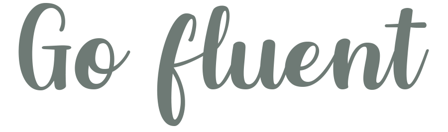
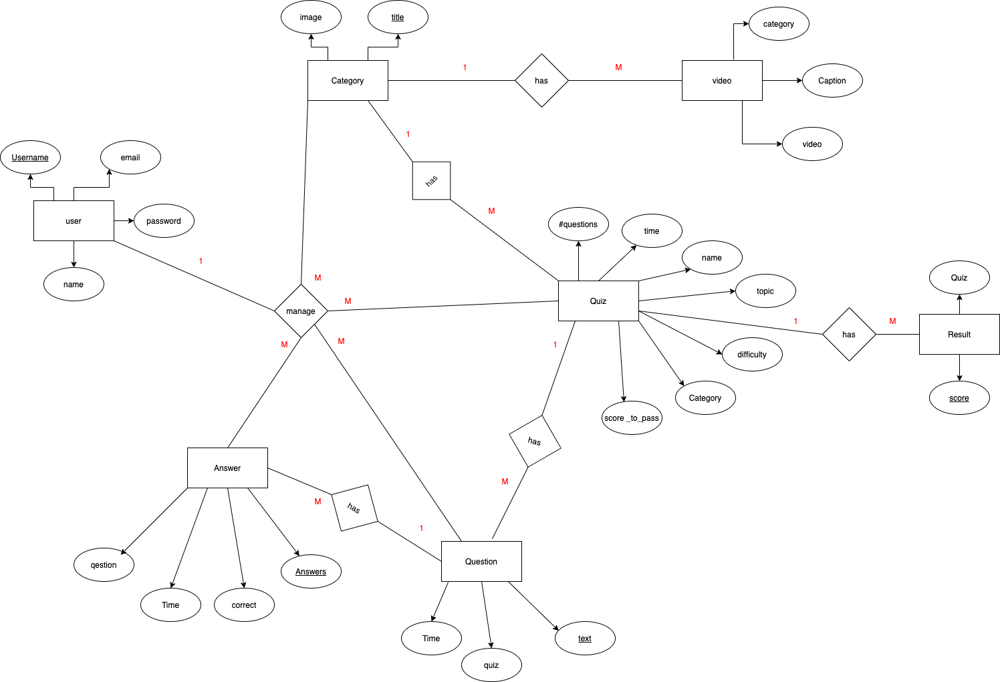
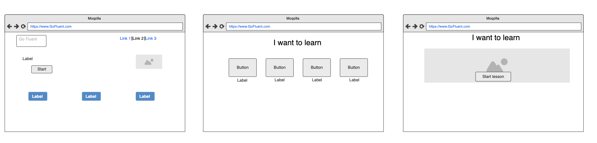
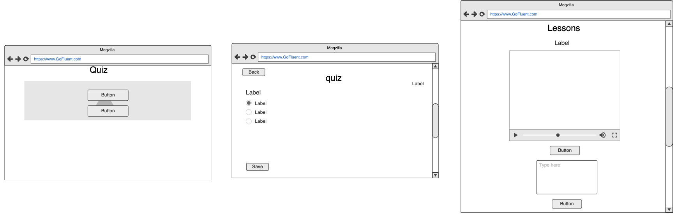
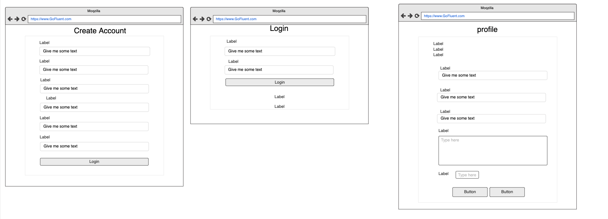
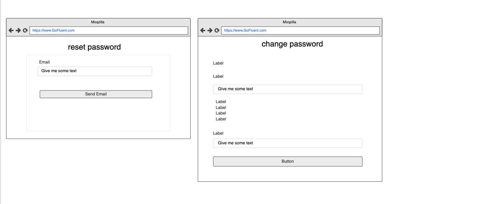

# Go-Fluent-Psi

#### Developed With ❤️ by PSI Group

## Project Discription
#### Website that helps you to learn new natural languages

### Group Members:

- Hajar Alharazi  

- Manal Alotaibi

- Njoud Aldarbas


---


## Technologies & Tools used 

* JavaScript/jQuery
* HTML/CSS
* Django
* Python
* Bootstrap
* Visual Studio Code
* Ajax
* sqlite DB
* coolers for Color palette picker
* moqups used for designing the Wireframe

---
## application architecture
### ER diagram



## User Stories

* As a user, i want to login/register, so that i can interact with the website
* As a user, i want press Start button , so i can see all language that available to learn
* As a user, I want to be able to choose a language, so that I can start learning it

* As a user, I want to press the quiz button to access the questions, so that I can test my Language skills 

* As a user, I want to press the lessons button to access the lesson immediately, so that I can watch videos and start taking the lessons

* As a user, i want to see my scores after finishing the quiz, so that i can I improve my language skills later


## Wireframe






---

### Unsolved Problems
```Python
def quiz(request, title):
    cat=Category.objects.get(title=title)
    quiz=Quiz.objects.filter(category=cat)
    return render(request,‘quizes/main.html’,{‘quiz’:quiz})
    
   ```
